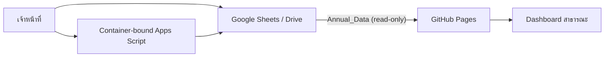

# Dashboard สถานการณ์การเพาะปลูกพืช จังหวัดกำแพงเพชร

เว็บ Dashboard แบบ responsive สำหรับข้อมูลพืชเศรษฐกิจ 9 ชนิด 11 อำเภอ พัฒนาด้วย React + TypeScript โดยใช้ GitHub Pages เป็น Frontend และ Google Sheets เป็นฐานข้อมูลหลัก

## ความสามารถของ Dashboard

- KPI พื้นที่เพาะปลูก พื้นที่เก็บเกี่ยว ผลผลิต และผลผลิตเฉลี่ยแบบถ่วงน้ำหนัก
- เปรียบเทียบผลการดำเนินงานกับปีก่อนหน้าอัตโนมัติ
- ตัวกรองปี ชนิดพืช และอำเภอ พร้อมปุ่มเลือกพืชทั้ง 9 ชนิด
- กราฟแนวโน้มรายปีที่สลับตัวชี้วัดได้ โดยไม่วางข้อมูลคนละหน่วยบนแกนเดียวกัน
- กราฟเปรียบเทียบรายอำเภอระหว่างปีที่เลือกกับปีก่อนหน้า
- กราฟสัดส่วนพื้นที่เพาะปลูกรายพืชหรือรายอำเภอ
- ตารางสรุปรายปีพร้อมอัตราเปลี่ยนแปลง และตารางรายละเอียดตรวจสอบย้อนกลับ
- แสดงสถานะคุณภาพข้อมูล แหล่งข้อมูล และเวลาที่ดึงข้อมูลล่าสุด

รูปแบบการวิเคราะห์อ้างอิงองค์ประกอบหลักจาก Power BI รายงานสถานการณ์การเพาะปลูก
แต่ปรับให้พืชทั้ง 9 ชนิดอยู่ใน Dashboard เดียว ลดการทำซ้ำของหน้ารายงาน และแก้ข้อจำกัด
ด้านการเปรียบเทียบข้อมูลต่างหน่วย

## เริ่มใช้งานในเครื่อง

```bash
npm install
npm test
npm run dev
```

Dashboard จะอ่านข้อมูลล่าสุดจากชีต `Annual_Data` โดยตรง หาก Google Sheets ไม่พร้อมชั่วคราว ระบบจะใช้ข้อมูล live ล่าสุดที่บันทึกไว้ในอุปกรณ์ และใช้ JSON snapshot เป็น fallback ลำดับสุดท้าย

### Dashboard รุ่น 4.4.3

- แก้หน้าเว็บว่างจาก React error #310 โดยทำให้ Hooks ถูกเรียกในลำดับคงที่ทุก render
- เพิ่ม ESLint และ React Hooks rules ใน CI เพื่อป้องกัน conditional Hook กลับมาอีก

### Dashboard รุ่น 4.4.2

- อัปเกรด Apache ECharts เป็น 6.1 เพื่อแก้ช่องโหว่ XSS และถอด React Router ที่ไม่ได้ใช้งาน
- ตรวจ Data Contract ก่อนใช้ข้อมูลสด, browser cache และ snapshot สำรอง
- ปฏิเสธ CSV ที่มีรหัสระเบียนซ้ำ ปีไม่สอดคล้อง ตัวเลขเสียรูป ค่าติดลบ หรือ quote ไม่ครบ
- ปรับตัวกรองปีและอำเภออัตโนมัติเมื่อชุดข้อมูลสดเปลี่ยน และแสดงสถานะเมื่อไม่มีข้อมูลเผยแพร่
- เพิ่ม automated tests สำหรับ CSV, cache และ snapshot รวมชุดทดสอบทั้งหมด 14 รายการ
- แยก snapshot เป็น production chunk เพื่อให้โค้ดหลักมีขนาดเล็กลงและ cache ได้เป็นอิสระ

### Dashboard รุ่น 4.4.1

- แสดง Dashboard จาก snapshot ที่ฝังใน production bundle ทันที แล้วตรวจข้อมูลล่าสุดจาก Google Sheets เบื้องหลัง
- หน้าเว็บไม่ค้างหรือกลายเป็นหน้าว่างเมื่อ Google Sheets, browser cache หรือ hosting path ใช้งานไม่ได้
- ตรึงแถบเลือกปี พ.ศ. ไว้ใต้เมนูหลักระหว่างเลื่อนหน้า ทั้ง Desktop และ Mobile
- แถบปีบนมือถือเลื่อนแนวนอนได้ เพื่อเลือกปีครบ พ.ศ. 2556–2566 โดยไม่ขยายหน้าเว็บ
- เพิ่มการตรวจ snapshot อัตโนมัติ: 792 ระเบียน 11 ปี 9 พืช และ 11 อำเภอ

### Dashboard รุ่น 4.4

- แถบปรับขนาดตัวอักษรเป็น `ก / ก+ / ก++` และปรับข้อความในกราฟตามระดับที่เลือก
- คลิกแท่งใน Bar chart เพื่อ Active ปีนั้นและกรอง KPI, กราฟ, Donut และตารางทั้ง Dashboard
- มีปุ่มเลือกปีใต้กราฟเป็นทางเลือกสำหรับคีย์บอร์ดและอุปกรณ์สัมผัส
- เพิ่มส่วนเข้าสู่ `Admin Data Manager` พร้อมอธิบายสิทธิ์และขั้นตอนเข้าใช้งาน
- Admin แสดงจำนวนระเบียนทั้งหมด/เผยแพร่/ฉบับร่าง/เก็บถาวร และกรองรายการตามสถานะได้
- Admin รองรับข้อมูลรายปีและรายเดือน พร้อม CRUD, soft delete, restore, backup และ audit log

### Dashboard รุ่น 4.3

- Bar chart เนื้อที่เพาะปลูกและผลผลิต แยกรายอำเภอ โดยแต่ละปี พ.ศ. ที่เลือกเป็นชุดแท่งคนละสี
- รองรับการเลือกปีเดียว หลายปี และปีที่ไม่ต่อเนื่อง พร้อม Legend ระบุปี
- ตารางรายปีแสดงลูกศรขึ้นสีเขียวเมื่อเพิ่ม และลูกศรลงสีแดงเมื่อลด
- แถบปรับขนาดตัวอักษรด้านบนปรับข้อความทั้งหน้าและในกราฟ พร้อมจดจำค่า
- กราฟรายอำเภอบนมือถือเลื่อนแนวนอนได้ เพื่อรักษาความอ่านง่ายของข้อมูลครบ 11 อำเภอ

### Dashboard รุ่น 4.2

- แก้ Data Contract ระหว่าง Google Sheets (`C01`–`C09`) กับรหัสภายในของ Dashboard
- แปลงสถานะ `active/valid` จากชีตเป็น `published/pass` อย่างชัดเจน
- ป้องกันการนำ cache รุ่นเก่าที่มีรหัสพืชผิดกลับมาใช้งาน
- แสดงสถานะการเชื่อมต่อข้อมูลสด ชื่อแท็บ จำนวนระเบียน ช่วงปี และเวลาตรวจสอบ
- เพิ่มปุ่มโหลดข้อมูลใหม่โดยไม่ต้องรีเฟรชหน้าและคำสั่ง `npm run data:audit`

### Dashboard รุ่น 4.1

- Card ตัวกรองปี พ.ศ. แบบเลือกหนึ่งปี หลายปี หรือปีที่ไม่ต่อเนื่อง
- แถบเลือกพืช 9 ชนิดด้านซ้าย
- สถานการณ์การผลิตเชื่อมโยงกับปี พืช และอำเภอที่เลือก
- Line Graph เนื้อที่เพาะปลูก และ Bar Graph ผลผลิต แยกตามปี
- Donut Graph ร้อยละเนื้อที่เพาะปลูกของพืชทุกชนิดในแต่ละปี
- ตารางสรุปพร้อมร้อยละเปรียบเทียบกับปีก่อนหน้าตามข้อมูลจริง
- แถบด้านซ้ายมี Bullet พืช 9 ชนิดพอดีและเลือกได้ครั้งละ 1 ชนิด
- แสดงเลขรุ่นบนหน้าเว็บเพื่อยืนยันว่า GitHub Pages Deploy โค้ดชุดล่าสุดแล้ว

รายละเอียดการตรวจสอบข้อกำหนดอยู่ที่ `docs/requirement-traceability-v4.1.md`

## สถาปัตยกรรม



หน้าเว็บอ่านเฉพาะข้อมูลสาธารณะ ไม่มี service-account key, OAuth secret หรือคำสั่งเขียน การเพิ่ม แก้ไข ลบ ตรวจสอบ และสำรองข้อมูลทำใน Google Sheets ผ่าน Container-bound Apps Script ตามสิทธิ์ของเจ้าหน้าที่

## โครงสร้าง

- `apps/web` Dashboard สาธารณะ
- `apps/web/src/dataSource.ts` ตัวเชื่อม Google Sheets, parser, cache และ fallback
- `google-apps-script` ระบบ CRUD หลังบ้าน, Sidebar, validation, backup และ audit
- `packages/shared` data contract และสูตรคำนวณร่วม
- `scripts/import` profiling/normalization จาก Excel
- `data/schema` ผล profiling แบบ machine-readable
- `docs` ระเบียบวิธี สถาปัตยกรรม และคู่มือ

โฟลเดอร์ `apps/api` เก็บต้นแบบ API จากระยะก่อนหน้าเพื่ออ้างอิง แต่ไม่อยู่ใน production build ของสถาปัตยกรรม GitHub Pages + Google Sheets

## ตั้งค่าแหล่งข้อมูล

ค่าปริยายชี้ไปยังไฟล์ `KPP Agricultural Data – Google Sheets Ready` และแท็บ `Annual_Data` แล้ว หากต้องการเปลี่ยน ให้คัดลอก `.env.example` เป็น `.env.local` และแก้:

```dotenv
VITE_GOOGLE_SHEET_ID=1lxQ5rS9xHTq_LlFTSQehsJSk-lTk4HzhlS8hq_0t47U
VITE_GOOGLE_SHEET_TAB=Annual_Data
```

ตัวแปรเหล่านี้เป็นรหัสแหล่งข้อมูลสาธารณะ ไม่ใช่ secret

## ตรวจสอบและ Build

```bash
npm run typecheck
npm test
npm run data:audit
npm run build
```

## Deploy บน GitHub Pages

1. นำไฟล์ชุดนี้ไปแทนที่ใน repository `Krit-PJ/KPP_Agri-Dashboard`
2. Commit และ push ไปยัง branch `main`
3. เปิด Settings → Pages และเลือก Source เป็น `GitHub Actions`
4. Workflow `.github/workflows/ci-pages.yml` จะทดสอบและ deploy `apps/web/dist`
5. รอให้ Actions งาน `CI and GitHub Pages` ผ่านครบทั้ง `test-build` และ `deploy`
6. ตรวจว่า Google Sheet อนุญาต `Anyone with the link: Viewer`

เว็บไซต์ production:

`https://krit-pj.github.io/KPP_Agri-Dashboard/`

ไฟล์ JSON ใน `apps/web/public/data` เป็นเพียง snapshot สำรอง ไม่ใช่ฐานข้อมูลหลัก

## ติดตั้งระบบเพิ่ม แก้ไข และลบข้อมูล

โค้ดพร้อมติดตั้งอยู่ใน `google-apps-script` โดยใช้ `Code.gs`, `Sidebar.html` และ
`appsscript.json` ติดตั้งเป็น Container-bound Apps Script ใน Google Sheet เป้าหมาย
จากนั้นรัน `installSystem` หนึ่งครั้ง เมนู `ระบบข้อมูลการเกษตร` จะปรากฏเมื่อเปิด Sheet ใหม่

ระบบรองรับข้อมูลรายปีและรายเดือน มีภาพรวมจำนวนระเบียนและตัวกรองสถานะ ป้องกัน
Business Key ซ้ำ สำรองค่าก่อนแก้ไข/ลบ เก็บ Audit Log และสำรองไฟล์ทั้งชุดไปยัง
Google Drive ได้ โดยไม่ต้อง Deploy Apps Script เป็น Web App
